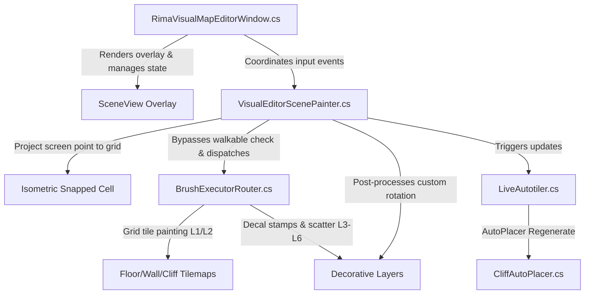

# RIMA Visual Map Designer - Design Log & Progress Tracker

This document serves as the persistent design log, architectural blueprint, and progress tracker for the RIMA Visual Map Designer (Level Editor). It is designed to be shared with Claude and other team members to understand the context, inspiration, and technical implementation.

---

## 🎨 Inspiration & Goals

* **Source of Inspiration:** [Sang Hendrix's Level Editor Tool on X/Twitter](https://x.com/sanghendrix96/status/2059176117769208034)
* **Goal:** Replicate a fluid, highly visual, grid-snapped level painting editor directly within Unity's SceneView.
* **Core Philosophies:**
  1. **Visual-First Interaction:** Floating palette UI overlaid directly inside the SceneView.
  2. **Intelligent Auto-Layering:** The designer selects an asset, and the editor automatically puts it on the correct layer (Floor, Wall, Cliff, Props) without manual switching.
  3. **Zero-Configuration Snapping:** Instant isometric alignment matching RIMA's cell grid dimensions.
  4. **Live Procedural Feedback:** Painting floor tiles automatically triggers cliff placements (`CliffAutoPlacer`) and wall join rules instantly in the background.

---

## 🛠️ System Architecture

The editor is isolated under the new directory `Assets/Editor/MapDesigner/VisualEditor/` to avoid interfering with the legacy brush window.

### Core Components:
1. **`RimaVisualMapEditorWindow.cs`**: Dockable window that initializes hooks and draws the overlay panel directly in `SceneView`.
2. **`VisualEditorScenePainter.cs`**: Handles screen-to-world isometric raycasting, snapping, grid boundaries, mouse-drags, ghost previews, and delegates placements to `BrushExecutorRouter`.
3. **`AutoLayeringService.cs`**: Routes selected assets automatically based on brush presets.
4. **`LiveAutotiler.cs`**: Instantly triggers localized `CliffAutoPlacer` regenerations when the floor is painted or erased.

---

## 📈 Session Progress Log

### Phase 1: Foundations & Backend Core (Complete)
* [x] **DESIGN_LOG.md Created:** Initialized persistent documentation log for Claude.
* [x] **AutoLayeringService implemented:** Routes preset categories dynamically to Floor/Wall/Cliff tilemaps.
* [x] **LiveAutotiler implemented:** Hooked to `CliffAutoPlacer` regenerator for real-time cliff updates.

### Phase 2: Painter Logic & Snap Projection (Complete)
* [x] **VisualEditorScenePainter implemented:** Raycasts screen mouse position onto the isometric grid, renders snapping diamond ghost previews, and coordinates paint strokes.
* [x] **Ghost GameObject/Sprite Previews:** Instantiates a temporary semi-transparent cyan-tinted preview of the selected prefab or sprite at the snapped cell location following the mouse cursor.
* [x] **Keyboard Rotation Shortcut:** Pressing **`R`** in the SceneView rotates the active preview ghost and placed objects by 90 degrees.
* [x] **Single-Cell Snapped Placement:** Painting with small brush sizes snaps the prefab/tile exactly to the center of the cell, avoiding random scattering.

### Phase 3: GUI Overlay Window (Complete)
* [x] **RimaVisualMapEditorWindow implemented:** Serves as the main settings manager and draws a clean, dark floating GUI overlay panel in `SceneView` showing brush names, active mode (Brush vs Erase), brush size sliders, and density controls. Intercepts mouse scrollwheel for instant brush size adjustments.
* [x] **Tilemap Name Resolution:** Automatically resolves RIMA's floor tilemap named `"Tilemap"` as a fallback for `"FloorTilemap"`.

### Phase 4: Native Engine Integration & Alignment (Complete)
* [x] **Integrate BrushExecutorRouter:** Replaced custom painting logic with RIMA's native `BrushExecutorRouter` engine.
* [x] **Bypass Walkable Limits:** Handled sandbox/walkable checks inside the level editor by creating a dummy $500 \times 500$ walkable grid and temporarily disabling `op.respectsWalkableMask` for precise editor painting anywhere.
* [x] **Props Custom Rotation:** Post-processes custom SceneView rotation inputs directly onto spawned objects after executor dispatch.
* [x] **Clean Deletion:** Deleted the temporary `ScatterBrushExecutor.cs` script to enforce strict conformance to the project's native pipeline.

