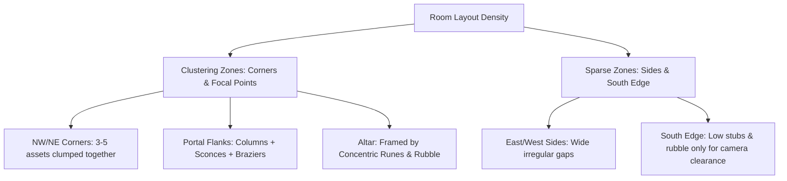

# RIMA Ruined-Keep Rooms: Organic & Natural Composition Rules

This document outlines the concrete composition rules, visual logic, and procedural layout recipes to transform rigid, grid-aligned greybox rooms into organic, ruined keeps. 

These rules are synthesized from the target aesthetic in `STAGING/concepts/chatgpt_ref/ChatGPT Image 22 May 2026 16_12_46 (1).png` and `.../25 May 2026 00_18_45 (2).png` which feature irregular broken masonry, varied heights, rubble clusters, asymmetry, and floating floor boundaries.

---

## 1. Break the Grid (Procedural Jitter & Variation)

A rigid perimeter of identical columns placed on a perfect rectangle looks artificial. To make wall and column runs look organic, apply the following procedural transformations:

*   **Position Jitter:** Jitter wall/column positions by $5\%$ to $15\%$ of a tile cell size off the strict grid line. Do not align them to a strict axis.
*   **Rotation Jitter:** 
    *   Rotate vertical columns slightly (randomly between $-5^\circ$ and $+5^\circ$) to simulate shifting stone and geological decay.
    *   For broken pillars and fallen slabs, rotate by $30^\circ$ to $90^\circ$ and let them cross tile boundaries, overlapping into neighboring cells.
*   **Scale Jitter:** Vary the local height/scale of walls and columns by $10\%$ to $25\%$ to represent uneven weathering and crumbling tops.
*   **Element Mix-ins:** Do not repeat a single pillar type. Use a pool of structural elements:
    *   `Monolithic Column` (Intact structural element)
    *   `Broken Column Stub` (Lower, shattered column)
    *   `Tall Wall Segment` (Vertical crumbling stone block)
    *   `Leaning Column / Slab` (Leaning against walls or the ground)
    *   `Rubble Pile` (Shattered heap of stone bricks)

---

## 2. Clustering vs. Spacing

Natural-looking ruins are characterized by clusters of heavy wreckage separated by wide open voids.



*   **Corners (High Density Cluster):** Always group assets in corners. Place 1 `Monolithic Column` flanked by a `Broken Column Stub`, 1-2 `Rubble Piles`, and patch decals.
*   **Portal Flanks:** The North gate should be heavily flanked by structural pieces (`Monolithic Column` + `Wall Sconces` + `Freestanding Braziers`) to create weight.
*   **Side Gaps (Sparse Zone):** Leave wide, irregular openings ($2$ to $4$ tiles wide) along the East and West sides. These voids act as negative space, framing the keep.
*   **South Edge Clearance:** To prevent player visibility blockages and maintain the high top-down 3/4 camera view, keep the South edge open. Use only `Broken Column Stubs` and small rubble clusters.

---

## 3. Asymmetry & Brokenness

To make the environment feel as though "it was once whole, now sundered," place props to suggest a timeline of destruction:

*   **Cause-and-Effect Placement:** When placing a `Broken Column Stub`, always place a corresponding `Rubble Pile` or `Toppled Statue` nearby. The rubble should align with the direction the pillar would have fallen.
*   **Asymmetric Balance:** Avoid symmetrical structures. If the North-West corner has a massive intact wall, the North-East corner should be crumbled into a wide gap with a leaning slab. 
*   **Sundering Axis:** Define a virtual "fracture line" running through the room (e.g., from South-West to North-East). Any wall or floor tile intersecting this line is replaced by `Cyan Floor Runes` (cracks) and heavy rubble, leaving the outer regions intact.

---

## 4. Focal Hierarchy

The player's eye should naturally navigate the room: **Gate (North) $\rightarrow$ Central Altar $\rightarrow$ Perimeter Framing**.

1.  **Primary Focus (North Portal):** A massive `Cyan Rift Archway` centered on the North wall, flanked by two large `Monolithic Columns` and lit by URP 2D lights.
2.  **Secondary Focus (Center-Back Altar):** A `Granite Altar` placed slightly off-axis in the center-back area, surrounded by a `Concentric Rune Circle` decal on the floor.
3.  **Framing (Perimeter):** Low-contrast rubble and broken stubs frame the scene, drawing the player's eye from the open South edge inward toward the Altar, then up to the North Portal.

---

## 5. Organic Floor-Void Boundary

RIMA Shattered-Keep rooms float over a dark navy void. The edges should look shattered, not square.

*   **Stepped Silhouette:** Do not build rectangular floor tilemaps. Construct the edge using a stepped, jagged silhouette.
*   **Displaced Tiles:** Place loose floor tiles jutting out into the void, or missing tile holes inside the room, revealing the dark void underneath.
*   **Fringe scatter:** Scatter small pebbles and dirt decals along the void edge to soften the hard cut.

---

## 6. Procedural Layout Recipe (C# Code Ready)

This recipe can be translated directly into procedural generation code:

```csharp
// Define Room Dimensions (e.g., 20x16)
int width = 20;
int height = 16;

// STEP 1: Generate Jagged Floor
// For each column X, randomly offset the MinY and MaxY edges by -1 to +1 tile to create steps.
// Leave 2-3 random holes (1x1 or 1x2 cells) in the interior floor tiles.

// STEP 2: North Portal (Primary Focal Point)
// At (X = width / 2, Y = height - 1), place the "Cyan Rift Archway" (3x4 size).
// Flank it with "Monolithic Columns" at X = (width / 2) - 2 and X = (width / 2) + 2.
// Place a "Freestanding Brazier" in front of each column.

// STEP 3: North Wall Runs (Asymmetric)
// Left of Portal: Place a 3-tile run of "Tall Wall Segments" with 1 "Wall Torch".
// Right of Portal: Leave a 1-tile gap, then place a 2-tile run of "Low Walls" ending in a "Broken Column Stub".

// STEP 4: East and West Walls (Irregular Gaps)
// West Wall: Place a "Monolithic Column" at NW corner, a 3-tile gap, 
// a "Leaning Column" tilted at 15 degrees, a 2-tile gap, and a "Broken Column Stub".
// East Wall: Place a "Toppled Statue" at NE corner, a 4-tile gap, 
// a "Tall Wall Segment" with a "Wall Torch", a 1-tile gap, and rubble.

// STEP 5: South Edge (Clear Silhouette)
// Open the South boundary. Place only 2 "Broken Column Stubs" (at X = 4 and X = 16) 
// and scatter 3-5 small "Rubble Piles" along the edge.

// STEP 6: Center-Back Altar (Secondary Focal Point)
// Place the "Granite Altar" (3x2) at X = (width / 2) - 1, Y = (height / 2) + 1 (slightly off-axis).
// Paint a flat "Concentric Rune Circle" decal directly underneath it.

// STEP 7: Scatter Rubble and Debris (Poisson Disc Clustering)
// Generate 5-8 rubble points clustered near wall bases and column joints.
// Spawn small stones and cave moss decals on floor tiles directly adjacent to the void.
```

---

## Summary of Reference Visuals (Mockups)

*   **ChatGPT Image 22 May (1):** Highlights high-contrast cyan light rays reflecting off dark masonry, and heavy corner rubble clusters.
*   **ChatGPT Image 25 May (2):** Shows irregular column heights and tilted slabs over a dark background void, creating a depth illusion in a top-down 3/4 perspective.
