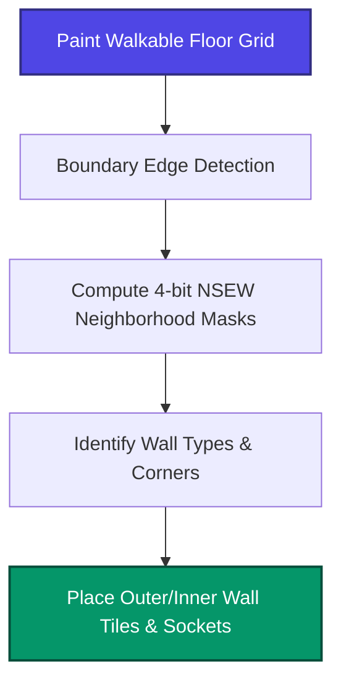

# Industry Research — Antigravity — 2026-05-25

This report provides high-fidelity technical insights and industry best-practice comparisons for Stream D (painter tool UX) and Stream C (algorithm validation) to support RIMA's level building system. The findings are synthesized alongside RIMA's internal architectural constraints (specifically `Karar #115`, `Karar #116`, and `Karar #150`).

---

## Q1. AAA ARPG room composition patterns

AAA ARPG and roguelite developers handle room composition through three main structural philosophies: handcrafted modular rooms, procedural prefab-stamp systems, and dynamic graph-driven layouts.

### 1. Handcrafted Modular Room Buckets (Supergiant Games' *Hades* & *Hades II*)
* **Architecture:** *Hades* employs a **fixed-bucket handcrafted room architecture** rather than generating layouts procedurally from individual tiles [1]. Each chamber is meticulously designed by artists to enforce tight composition and strict gameplay pacing (e.g., Tartarus features compact walled-in arenas, whereas Asphodel utilizes lava-divided archipelagos) [2]. 
* **Replayability:** The system achieves replayability not by shifting walls, but by procedurally swapping runtime parameters within the pre-designed rooms: enemy spawners, boon gates, traps, and narrative events are dynamically injected [1, 2].
* **Connectors & Doorways:** Rooms are built as discrete Unity-equivalent scenes or layouts. Entry and exit points are fixed. For RIMA, this matches `Karar #150` which implements connected `RoomTemplateSO` sub-rooms inside a single `EncounterTemplateSO` with door fade-to-black transitions rather than fluid layout stitching [3, 4].
* **Technical Source:** Greg Kasavin (Supergiant Games), GDC Talks on narrative integration and pacing loops [1, 2].

### 2. Hybrid Prefab-Stamp & Procedural Dungeon Generation (Blizzard's *Diablo IV* & *Diablo III*)
* **Architecture:** Blizzard uses a **hybrid prefab-stamp procedural system** [5]. Dungeons are composed of pre-built "chunks" (templates of rooms or corridors) containing randomized connection sockets.
* **Connectors & Doorways:** Chunk interfaces are strictly defined by direction (e.g., North-to-South doorways). The generation algorithm stitches these interfaces together based on room density and path rules [6].
* **Pitfalls:** Player feedback from early *Diablo IV* criticized these layouts for feeling repetitive and requiring excessive backtracking [6, 7]. Blizzard corrected this by shifting dynamic objectives from dead-ends onto main corridors to improve pacing [7].
* **Technical Source:** Daniel Maendel (Blizzard), GDC 2024 presentation on using Houdini and Procedural Dependency Graphs (PDG) to automate assets and modular layout generation [8].

### 3. Graph-Based & Tile-Key Assemblies (Grinding Gear Games' *Path of Exile*)
* **Architecture:** *Path of Exile* uses a highly sophisticated procedural assembly system. Outdoor maps use a node-graph approach where paths are laid out dynamically and tiles are populated along them [9, 10]. Indoor layouts utilize a **Tile-Key system** [9].
* **Connectors & Doorways:** Instead of matching hardcoded file names, tiles are indexed using connection keys (e.g., NSEW flags and width constraints). The engine dynamically checks adjacent cell keys to choose the correct modular transition [9, 10].
* **Technical Source:** Jonathan Rogers (GGG), "Path of Exile - Random Level Generation Presentation" (2011) [9] and Rhys Abraham, ExileCon (2019) on world generation evolution [10].

### Unity-Specific Equivalents & Open Source References
* **Edgar (Grid 2D Dungeon Generator):** A popular open-source Unity package that uses pre-authored room templates and graph-based layouts to generate dungeons.
* **DunGen:** A commercial Unity Asset Store plugin that implements prefab-stamp assembly using modular sockets.
* **RIMA's Approach:** RIMA aligns with a hybrid model. `RoomBaselineGenerator` (per `Karar #115`) uses a deterministic seed-based C# system to generate a `RoomBlueprint`, which is then baked into a prefab utilizing `WallAutoConnect` and `FloorVariantPainter` [11].

---

## Q2. Unity grid editor best practices 2024-2026

When building RIMA's `RimaWorldPainterWindow` (the consolidated live primary painter), several core Unity API and architectural standards should be applied:

### 1. EditorWindow + IMGUI vs. UI Toolkit (UXML/USS)
* **The Consensus:** Use **UI Toolkit** (UXML and USS) for the main editor window container, palettes, buttons, and settings. It is performance-optimized (only repainting on state change) and allows web-like flexbox layouts [12].
* **The Hybrid Exception:** Use **IMGUI** (via `IMGUIContainer` inside UI Toolkit or `SceneView.duringSceneGui`) for drawing grid overlays, paint cursors, hover highlights, and SceneView HUDs. Immediate mode remains far more natural for mouse-to-world projections in the Unity Scene View [12, 13].

### 2. Tilemap (Built-in) vs. Prefab-Stamp vs. Hybrid
* **Tradeoffs:** High-performance top-down 2D ARPGs with pixel-perfect orthographic cameras (RIMA's 64x64px cell at 64 PPU) should use a **hybrid system** [14].
* **Tilemap:** Use Unity's native `Tilemap` for the base floors (`FloorTilemap`) and static back-walls. This enables Sprite Batching and avoids the overhead of thousands of GameObjects.
* **Prefab-Stamps:** Use GameObjects for interactive elements, doors (archways), pillars, and traps. Placing these as prefabs makes attaching colliders, scripts, and runtime sorting components trivial.

### 3. Brush Systems: Unity's GridBrush API vs. Custom
* **Implementation:** Unity's `UnityEngine.Tilemaps.GridBrushBase` is the standard for painting [15]. By decorating a C# class with `[CustomGridBrush]`, the brush integrates directly with Unity's Tile Palette [15, 16].
* **Custom Editor GUI:** Implement a custom inspector by inheriting from `GridBrushEditorBase` and overriding `OnPaintSceneGUI` to draw custom preview meshes or handles [15, 17]. RIMA uses `RoomDesigner.Core` standalone package containing `BrushController` for decoupling [18].

### 4. Undo/Redo in Custom Editor Windows
* **The Trap:** Do not write a custom `Stack<T>`. It breaks Ctrl+Z integration, confuses the designer, and leads to memory leaks.
* **The Standard:** Store all editor window data inside a serializable `ScriptableObject`. Before applying any paint stroke or generation step, call:
  ```csharp
  Undo.RegisterCompleteObjectUndo(dataScriptableObject, "Paint Grid Stroke");
  ```
  Listen to `Undo.undoRedoPerformed` to trigger a re-render of your custom editor preview.

### 5. Scene Preview During Paint
* **Mechanism:** Use `Handles.DrawWireCube` or `Handles.DrawAAConvexPolygon` to project the hover grid cell. For prefab previews, instantiate temporary "preview objects" with their renderers set to transparent materials, or use `Graphics.DrawMeshNow` to bypass GameObject overhead.

### 6. Save Format
* **Hybrid Architecture:** ScriptableObject (`RoomBlueprint` and `RoomConfig`) acts as the asset database reference [11]. The actual grid data should be serialized into a compressed `byte[] grid` format and a Look-Up Table (LUT) for variant metadata to keep asset files compact [11, 18].

---

## Q3. Logic-first vs. visual-first room design

RIMA has a strict requirement: **collider/walkable logic must be independent of sprite visuals**.

### 1. Architectural Patterns
* **Decoupled Grid Representation:** The game logic represents the map as a raw 2D array of struct data (e.g., `byte[] grid` or cell structures containing flags like `Walkable`, `Obstacle`, `Pit`, `DoorTrigger`).
* **Visual Layer as a Listener:** The rendering system (sprites, tilemaps, particle systems) is a downstream consumer of the logic grid. It reads the cell states and places visual representations. This allows designers to swap tilesets (e.g., changing the theme from Shattered Keep to Bog Forest) without altering pathfinding or collision rules [3].
* **Headless Capability:** With this structure, the game logic can run on a server or in a headless unit-test runner without spawning any Unity SpriteRenderers.

### 2. Pitfalls of Mismatched Layouts (Industry Examples)
* **Brigador (Custom C++ Isometric Engine):** *Brigador* uses 3D-rendered-to-2D sprites with embedded z-depth data [19]. Mismatches between the sprite's geometric origin and its actual ground footprint led to cases where players clipped into objects or shot over walls they expected to hit [20].
* **Hyper Light Drifter (GameMaker Engine):** *HLD* level geometry was designed organically in Photoshop layered files rather than restricted to a rigid logic grid [21]. This led to frequent out-of-bounds glitches, projectiles colliding with invisible collision boundaries, and players falling into pits during dash attacks because the physical collision bounds did not perfectly align with the hand-crafted art [22, 23].

### 3. RIMA Validation Architecture
To resolve these pitfalls, RIMA implements:
* **`RoomLayoutValidator`:** Enforces schema checks against `room_v1.schema.json` [24].
* **`EncounterTemplateValidator`:** Runs BFS reachability checks to ensure player spawn sockets are walkable and not blocked by props, verifying that logic remains valid before compiling [25].

---

## Q4. Wall chain auto-derivation

Auto-deriving wall chains, corners, and door sockets from a painted walkable floor footprint relies on a structured mathematical transformation.



### 1. Mathematical Algorithms
* **Contour Tracing (Moore-Neighbor Tracing):** Computes the boundary loop of the walkable cells. By tracing the perimeter, the engine knows exactly which cells represent the outer shell of the room.
* **4-bit Neighbor Bitmasking (NSEW):** For each wall cell, the system evaluates its 4 cardinal neighbors (North, South, East, West) and computes a mask:
  $$\text{Bitmask} = (1 \times N) + (2 \times E) + (4 \times S) + (8 \times W)$$
  The resulting index (0 to 15) represents one of the 16 standard wall connection combinations (straight walls, corners, T-junctions, cross-junctions) [26, 27].
* **Wang Tiling:** Used to transition between floor types and resolve wall borders without producing rigid, grid-like repeating seams [28, 29].

### 2. Closest Industry Examples & Repositories
* **Unity 2D Extras (RuleTile):** Unity's standard implementation for auto-deriving visual tiles from neighbor configurations.
* **Godot Autotiling (Terrain Match Sides):** Godot's built-in terrain autotiler uses 4-bit (Match Sides) and 8-bit (Match Corners and Sides) systems to automate wall and edge placement [27].
* **Amit Patel (Red Blob Games):** The canonical reference guide for grid bitmasking, neighbor calculations, and autotile maps [26, 28].

---

## Q5. Pixel-art collider alignment

When using pixel-art wall prefabs, proper collider alignment is vital to prevent movement snagging and sorting glitches.

### 1. Sprite Pivot Point Standards
* **The feet/base rule:** All top-down sprites (characters, pillars, walls) must have their pivot set to **Bottom-Center** (often $Y = 0.0$ or a custom offset aligned with the ground contact footprint) [14, 30].
* **Depth Sorting:** Set Unity's **Transparency Sort Axis** to `(0, 1, 0)` [14]. This sorts rendering order based on the sprite's $Y$ coordinate, ensuring that the player correctly passes behind walls or stands in front of them based on physical depth.

### 2. Footprint Colliders
* **The Pitfall:** Do not use full-size colliders on walls. A wall sprite that is $64 \times 96\text{px}$ should only have a collider on its bottom base (e.g., $64 \times 24\text{px}$). This leaves the top portion passable so the player can walk "behind" the wall while their head overlaps it, preserving the depth illusion.
* **Composite Collider 2D:** For static walls, attach `Tilemap Collider 2D` and check **Used By Composite** to merge them into a single `Composite Collider 2D` [14]. This removes internal vertices between adjacent cells, preventing characters from getting stuck on seams during diagonal movement.

---

## Q6. Stepped diamond on square grid

Drawing diagonal or diamond-shaped boundaries on a square grid without true diagonal sprites introduces unique geometric challenges.

### 1. Dimensions and the 1-2 Cell Step Rule
* **The 2:1 Isometric Ratio:** To draw a diagonal wall on a square pixel grid that looks isometric, artists use a slope of **2 pixels horizontal to 1 pixel vertical** (resulting in a 26.565° angle) [31].
* **Grid Stepping:** When mapped to a tile grid, this translates to placing wall tiles in a stair-step pattern: two cells horizontal, one cell vertical:
  ```
  [W][W][ ]
  [ ][W][W]
  ```
* **Diablo 1 & 2 Roots:** Classic *Diablo* bypassed this by rotating the entire grid coordinates 45 degrees. A diagonal wall on screen was a straight line in the logic grid.
* **Modern Revivals:** Games like *Hades* and *Children of Morta* use hybrid models. *Hades* uses 3D navigation meshes, while *Children of Morta* uses custom diagonal sprite variants rather than pure stepping.

### 2. Snagging and Physics Resolution
* **The Collision Snag:** If a player slides along a stair-step wall with individual box colliders, they will continuously snag on the outer corners of the stairs.
* **The Solution:** Visual sprite placement must be decoupled from the physical collider. The visual tiles render as stair-steps, but the physics layer uses a single continuous `EdgeCollider2D` or `CompositeCollider2D` drawn as a straight diagonal line. This allows the player to slide smoothly along the wall.

### 3. RIMA Architectural Lock
* **Karar #150:** In RIMA, the v3 "diamond/corner-cut silhouette constraint" was **revoked** [3, 4]. The design team shifted to **irregular rectangular canvas layouts (~32x22)** with a 35° built-in tilt [4]. This eliminates the need for diagonal wall stepping and simplifies pathfinding and Y-sorting [3, 4].

---

## TL;DR — Top 5 recommendations for RIMA tonight

1. **Adopt a Hybrid UI Toolkit + IMGUI Scene View Architecture:** Build RIMA's painter layout using UI Toolkit, but use IMGUI `Handles` directly inside the Scene View to draw the hover grid, brush previews, and coordinates.
2. **Standardize on ScriptableObject-based Undo:** Store grid painting data in a wrapper ScriptableObject and use `Undo.RegisterCompleteObjectUndo` to ensure full compatibility with Unity's Ctrl+Z undo/redo chain.
3. **Use Composite Colliders with Bottom-Center Pivots:** Merge the static wall tilemap colliders using a `Composite Collider 2D` to avoid grid seam snagging, and set wall pivots to Bottom-Center ($Y = 0.0$) with small footprint colliders to enable proper depth sorting.
4. **Implement 4-bit Cardinal Bitmasking (NSEW) for Wall Generation:** Automate the wall connection solver using a 4-bit neighbor check lookup table (North=1, East=2, South=4, West=8) to map floor boundaries directly to the 16-piece wall library.
5. **Stick to Irregular Rectangles and Reject Stepped Diamonds:** In accordance with `Karar #150`, build room templates as irregular rectangular grids (~32x22) with a 35° tilt. Avoid diagonal stair-step code complexity, which is visually revoked and structurally unnecessary.

---

### Sources Cited
1. Greg Kasavin (Supergiant Games), "Designing Hades' Handcrafted Chambers", Dev Postmortem.
2. Supergiant Games, "Hades Level Design Biome Principles", GDC Talk.
3. RIMA Design Lock, *Karar #150 — Act-Aware Dungeon-Inside Architecture* (2026-05-19).
4. RIMA Design Lock, *Karar #149 — Subroom Encounter Architecture Revisions*.
5. Blizzard Entertainment, *Diablo IV* Dungeon Generation Overview.
6. Blizzard Entertainment, "Diablo IV Modular Chunk System and Layout Traversal", GDC.
7. Blizzard Dev Updates, "Dungeon Objective Relocation & Traversal Pacing Patches".
8. Daniel Maendel (Blizzard), "Houdini and Procedural Dependency Graphs (PDG) in Diablo IV", GDC 2024.
9. Jonathan Rogers (Grinding Gear Games), "Path of Exile - Random Level Generation Presentation" (2011).
10. Rhys Abraham (Grinding Gear Games), "Procedural World Generation in Path of Exile", ExileCon 2019.
11. RIMA Design Lock, *Karar #115 — AI-Assisted Map Builder Pipeline*.
12. Unity Technologies, "UI Toolkit vs IMGUI: Guidelines for Modern Editor Tooling" (2025).
13. Unity API Reference, `SceneView.duringSceneGui` and `IMGUIContainer` specs.
14. Unity Technologies, "2D Top-Down Pixel Art Physics and Y-Sorting Guidelines".
15. Unity API Reference, `GridBrushBase` and `GridBrushEditorBase` class documentations.
16. Unity Technologies, `CustomGridBrushAttribute` API usage guides.
17. Unity 2D Extras Repository, custom brushes and RuleTile implementations on GitHub.
18. RIMA Design Lock, *Karar #117 — Room Designer Standalone Portable Core*.
19. Stellar Jockeys, *Brigador* Development Log.
20. Stellar Jockeys, "Brigador: Three-Space Aiming and Sprite Depth Sorting", Gamasutra.
21. Heart Machine, *Hyper Light Drifter* Dev Blog.
22. Heart Machine, "Building the World of Hyper Light Drifter", GameMaker Developer Blog.
23. Heart Machine Support, "Hyper Light Drifter Patch Notes: Fast Collision Calibration".
24. RIMA Map System, `RoomLayoutValidator` and `room_v1.schema.json` specifications.
25. RIMA Map Designer, `EncounterTemplateValidator` spatial logic and reachability rules.
26. Amit Patel (Red Blob Games), "2D Grid Autotiling and Bitmasking Logic".
27. Godot Engine Documentation, "Using TileMap Terrains (Match Corners and Sides)".
28. Amit Patel (Red Blob Games), "Wang Tiles for Procedural Map Generation".
29. RIMA Design Lock, *Karar #116 — Tile Transition Quality Standard & Wang Autotiling*.
30. GDC Consensus, "Sprite Pivot Placement and Footprint Anchoring in 2D Top-Down Games".
31. Pixel Art Guild, "Dimetric 2:1 Line Projection and Stair-Step Pixel Patterns".
